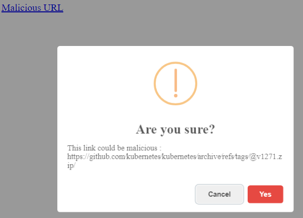

# ZipTLD
Extremely simple Chrome extension that prompt for confirmation when clicking on links redirecting to `.zip` tld.

The only purpose was to introduce me to Chrome extension development thru an actual and recent usecase, it is not meant to be used as a real security tool.
